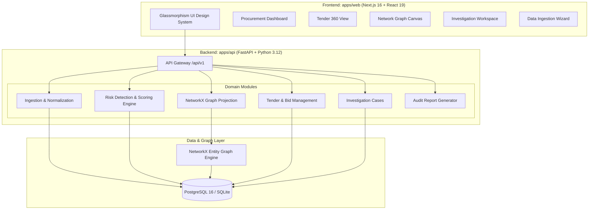
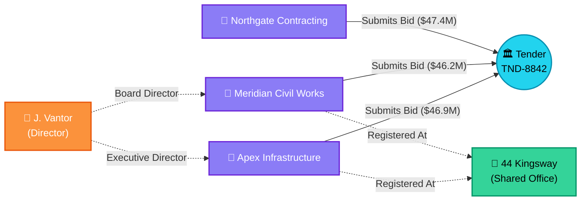

# 🌐 CartelNet

> **Detect procurement risk. Understand the evidence. Act before public money is exposed.**

[](https://nextjs.org/)
[](https://fastapi.tiangolo.com/)
[](https://networkx.org/)
[](https://www.postgresql.org/)
[](https://github.com/dchappy20k/cartelnet)
[](https://pytest.org/)

---

## 📋 Table of Contents
1. [The Challenge: Why Procurement Needs CartelNet](#-the-challenge-why-procurement-needs-cartelnet)
2. [The Solution: Explainable Risk Intelligence](#-the-solution-explainable-risk-intelligence)
3. [Key Features & Capabilities](#-key-features--capabilities)
4. [Deterministic Risk Detectors](#-deterministic-risk-detectors)
5. [End-to-End System Architecture](#-end-to-end-system-architecture)
6. [Interactive Network Graph & Resolution](#-interactive-network-graph--resolution)
7. [The Golden Flow: Judge & User Walkthrough](#-the-golden-flow-judge--user-walkthrough)
8. [Safety, Legal & Ethical Guardrails](#-safety-legal--ethical-guardrails)
9. [Technology Stack](#-technology-stack)
10. [Repository Structure](#-repository-structure)
11. [Quickstart & Installation](#-quickstart--installation)
12. [API Reference Overview](#-api-reference-overview)
13. [Verification & Testing](#-verification--testing)
14. [Product Roadmap](#-product-roadmap)

---

## 🚨 The Challenge: Why Procurement Needs CartelNet

Every year, governments and public institutions worldwide spend trillions of dollars purchasing infrastructure, medical equipment, school catering, and technology solutions. According to the OECD and World Bank:
- **10% to 30% of public procurement value** is lost annually due to anti-competitive practices, bid rigging, and collusive coordination.
- **Traditional auditing is reactive and siloed**: Audits typically occur 12–36 months after contracts are awarded and public funds have already been disbursed.
- **The "Black Box" Legal Trap**: Machine learning models that output arbitrary probabilities or "guilty" scores are legally unusable in court and administrative tribunals. Procurement officers cannot freeze public bids based on unexplainable neural network outputs.
- **Fragmented Data**: Shell corporations, nominee directors, and shared physical addresses are deliberately obscured across thousands of tender PDFs, unstructured CSV files, and disjointed company registries.

---

## 💡 The Solution: Explainable Risk Intelligence

**CartelNet** is an institutional-grade SaaS platform engineered for public procurement authorities, anti-monopoly commissions, state auditors, and integrity teams.

CartelNet proactively flags suspicious bidding patterns **before** contracts are executed. Built on a deterministic mathematical and relational graph core, every risk signal is strictly traceable to underlying data evidence, timestamps, and verifiable calculations.

```
       [ Unstructured Bids & Registries ]
                       │
                       ▼
       [ Ingestion & Normalization Engine ]
       - Suffix Stripping, Director Name Normalization
       - SHA-256 Physical Address Spatial Clustering
                       │
                       ▼
       [ Deterministic Risk Detection Engine ]
       - Price Clustering (CV <= 1.5%)
       - Shared Directorship Intersections
       - Shared Physical Addresses
       - Cross-Tender Repeated Co-Bidding
       - Historical Alternating Winner Patterns
                       │
                       ▼
       [ NetworkX Graph Projection Engine ]
       - Tenders, Bidders, Directors, Addresses, Subcontractors
                       │
                       ▼
       [ Human Decision Support & Case Management ]
       - Tender 360 Risk Breakdown
       - Interactive Canvas & Entity Inspection Dossier
       - Immutable Audit Evidence Preservation & Report Export
```

> **Important Product Rule:** CartelNet is a decision-support platform for human investigators. It **never** declares legal guilt or proof of crime. It flags "Risk Signals", identifies "Elevated Risk", and organizes verifiable evidence for informed human review.

---

## ✨ Key Features & Capabilities

### 1. Ingestion Pipeline & Entity Normalization
- Ingest standard procurement datasets (CSV, Excel) or synthetic benchmark data with built-in schema validation.
- Normalizes corporate entities by stripping legal suffixes (`Ltd`, `LLC`, `Corp`, `GmbH`, `S.A.`).
- Standardizes director names and honorifics (`Dr.`, `Eng.`, `Mr.`, `Ms.`).
- Normalizes physical addresses and clusters shared properties using deterministic SHA-256 location hashing.

### 2. Explainable 0–100 Risk Scoring
- Transparent, weighted scoring combining statistical bid analysis and relational network signals.
- Clear risk severity bands:
  - 🟢 **Low Risk (0–29)**: Standard competitive variance.
  - 🟡 **Medium Risk (30–49)**: Mild anomalies warranting standard verification.
  - 🟠 **High Risk (50–69)**: Multiple overlapping risk indicators.
  - 🔴 **Critical Priority (70–100)**: Strong structural anomalies requiring human investigative hold.

### 3. Interactive Network Graph Explorer
- Dynamic 2D graph projection powered by NetworkX.
- Real-time visualization of relationships between **Tenders**, **Bidders**, **Directors**, **Registered Addresses**, and **Subcontractors**.
- Click-to-inspect entity dossiers displaying win/loss history, co-bidding frequencies, and connected officers.

### 4. Tender 360 Workspace
- Comprehensive dossier for each procurement contract.
- Complete bidding spread with winning margins, timestamp logs, connected risk signals, and underlying JSON evidence payloads.

### 5. Investigation Case Management
- Promote flagged tenders or suspicious supplier clusters directly into formal investigation cases.
- Assign lead investigators, log timestamped audit notes, attach supporting evidence, and track case statuses (`Under Review`, `Escalated`, `Closed`).

### 6. Institutional Audit Report Generator
- One-click export of structured procurement intelligence reports (Executive Summary, Mathematical Evidence Log, and Entity Dossier) ready for integrity review.

---

## 🔬 Deterministic Risk Detectors

CartelNet avoids opaque "black-box" models. Its screening core consists of 5 deterministic detectors implemented with NumPy, Pandas, and NetworkX:

| Detector Code | Rule Name | Detection Mechanism | Severity |
|---|---|---|---|
| `PRICE_CLUSTERING` | Narrow Bid Spread / Price Clustering | Calculates the Coefficient of Variation ($CV = \frac{\sigma}{\mu}$) across bids. Flags tenders where $CV \le 1.5\%$ or bid amounts cluster within suspicious micro-margins. | High (25 pts) |
| `SHARED_DIRECTORS` | Shared Directorship Intersections | Performs pairwise entity graph traversal over company registry records to detect common executive officers, board members, or owners bidding on the same contract. | Critical (35 pts) |
| `SHARED_ADDRESS` | Shared Registered Address | Compares normalized address hashes to identify competitors registered at the same physical office, suite, or virtual mailbox. | High (25 pts) |
| `REPEATED_PARTICIPATION` | Persistent Co-Bidding Pattern | Tracks historical participation across multiple tenders to detect pairs of bidders repeatedly appearing together without genuine price competition. | Medium (15 pts) |
| `HISTORICAL_ROTATION` | Alternating Winner Rotation | Analyzes sequential contract awards to flag cyclical bid-rotation patterns where companies take turns submitting the winning proposal. | High (20 pts) |

---

## 🏗️ End-to-End System Architecture

CartelNet is structured as a **Modular Monolith** organized into two clean application layers:



### Architectural Principles
1. **Separation of Concerns**: Domain logic is strictly isolated in services (`service.py`), keeping API route handlers lean and testable.
2. **Deterministic & Auditable**: Every detector is deterministic; given identical input records, it will always compute the exact same risk signals and evidence keys.
3. **Database Flexibility**: Native PostgreSQL for enterprise cloud deployments with seamless SQLite in-memory fallback for local development and CI/CD pipelines.

---

## 🕸️ Interactive Network Graph & Resolution

CartelNet projects complex corporate registries and procurement contracts into an interactive multi-type graph:



---

## 🏆 The Golden Flow: Judge & User Walkthrough

Experience the primary end-to-end user journey in under 5 minutes:

### 1. Ingest Data / Seed Demo
Navigate to `/data` and click **"Load Benchmark Demo Dataset"**. CartelNet seeds 17 realistic procurement bids across 4 major tenders, including real-world synthetic collusion test cases (such as `TND-8842: Regional Highway Resurfacing Programme`).

### 2. Global Risk Screening
Navigate to `/screening` or the main Dashboard. Trigger the risk screening engine (`POST /api/v1/risk/screen-all`). CartelNet evaluates every tender across all 5 deterministic detectors in milliseconds.

### 3. Inspect Tender 360
Open `TND-8842`. Notice its **Score of 85 (Critical)**:
- **Price Clustering**: Bids submitted by Apex ($46.9M), Meridian ($46.2M), and Northgate ($47.4M) have a $CV$ of just $1.07\%$.
- **Shared Directors**: Directorship registry reveals that executive officer `J. Vantor` sits on the boards of both competing bidders.
- **Shared Address**: Both companies share `44 Kingsway` as their registered headquarters.

### 4. Explore the Entity Network
Switch to the **Network** tab or `/network`. The interactive canvas dynamically renders the entity cluster, visually isolating the shared directorship bridge and joint bidding triangle.

### 5. Open an Investigation Case
Click **"Open Investigation"**. Assign a lead compliance auditor, add notes, and link the mathematical evidence items.

### 6. Export Report
Click **"Generate Audit Report"** to export an executive-ready dossier detailing the evidence chain and timestamped audit logs.

---

## 🛡️ Safety, Legal & Ethical Guardrails

CartelNet is built with strict, non-negotiable product safety policies:

1. **No Presumption of Guilt**: CartelNet never uses defamatory, legally definitive language such as *"Cartel detected"*, *"Company is guilty"*, or *"Fraud confirmed"*. Instead, it reports objective findings: *"Risk Signal"*, *"Elevated Risk"*, *"Requires Human Review"*, and *"Potential Coordination Pattern"*.
2. **Complete Explainability**: Black-box predictions are banned. Every signal provides a detailed formula, the relevant threshold, the exact delta, and clickable links to raw records.
3. **Decision Support Only**: CartelNet acts as an assistive copilot for qualified human procurement officers, auditors, and legal teams.

---

## 💻 Technology Stack

### Frontend Application (`apps/web`)
- **Framework:** Next.js 16 (App Router) + React 19
- **Styling:** Tailwind CSS + Vanilla CSS Custom Design System
- **Aesthetic:** Dark Glassmorphism with customized backdrop filters, glowing gradients, and responsive panels
- **Icons:** Lucide React
- **Visualization:** SVG force-directed interactive graph with hover glow and connected edge isolation

### Backend API (`apps/api`)
- **Framework:** FastAPI (Python 3.12)
- **Data Validation & Schemas:** Pydantic v2
- **ORM & Database:** SQLAlchemy 2.0 (PostgreSQL & SQLite)
- **Graph Analytics:** NetworkX
- **Statistical Analytics:** NumPy & Pandas
- **Testing:** Pytest & HTTPX Async Client

---

## 📂 Repository Structure

```
cartelnet/
├── apps/
│   ├── web/                          # Next.js 16 Glassmorphism Frontend
│   │   ├── app/                      # Next.js App Router (Dashboard, Tenders, Network, Cases, Data)
│   │   ├── components/               # Glassmorphic UI components, Network Graph, Drawers
│   │   ├── lib/                      # Utilities, API clients, and mock data
│   │   └── package.json
│   │
│   └── api/                          # FastAPI Modular Backend
│       ├── app/
│       │   ├── core/                 # Config, security, database session
│       │   ├── db/                   # Declarative base & multi-tenant models
│       │   ├── modules/              # Modular Domain Architecture
│       │   │   ├── ingestion/        # Ingestion, parsing, normalization
│       │   │   ├── risk/             # 5 Deterministic Detectors & Scoring Engine
│       │   │   ├── network/          # NetworkX Graph Projection & Clusters
│       │   │   ├── tenders/          # Tender CRUD & Tender 360
│       │   │   ├── companies/        # Entity dossiers & directors
│       │   │   ├── bids/             # Bid submissions
│       │   │   ├── investigations/   # Case management & notes
│       │   │   └── reports/          # Report generation
│       │   └── main.py               # FastAPI entrypoint & CORS middleware
│       ├── requirements.txt
│       └── tests/                    # Pytest test suite (100% passing)
│
├── data/
│   └── demo/                         # Benchmark synthetic procurement datasets
├── docs/                             # 12 Master Architecture & Domain Specification Docs
├── docker-compose.yml                # Multi-container orchestration (Web, API, Postgres)
├── .env.example                      # Environment variables template
└── README.md                         # Project documentation
```

---

## 🚀 Quickstart & Installation

### Option A: Running with Docker Compose (Recommended)

To run the complete platform (PostgreSQL, Backend API, and Next.js Frontend) in one command:

```bash
# 1. Clone repository
git clone https://github.com/dchappy20k/cartelnet.git
cd cartelnet

# 2. Copy environment file
cp .env.example .env

# 3. Launch with Docker Compose
docker-compose up --build
```
- **Web App:** [http://localhost:3000](http://localhost:3000)
- **API Swagger Docs:** [http://localhost:8000/docs](http://localhost:8000/docs)
- **API Health Check:** [http://localhost:8000/api/health](http://localhost:8000/api/health)

---

### Option B: Local Development Setup

#### Prerequisites
- Node.js 18+ and `npm`
- Python 3.12+

#### 1. Setup Backend API (`apps/api`)
```bash
cd apps/api

# Create and activate virtual environment
python -m venv .venv

# Windows:
.venv\Scripts\activate
# Linux/macOS:
# source .venv/bin/activate

# Install dependencies
pip install -r requirements.txt

# Run FastAPI dev server (defaults to local SQLite fallback if PostgreSQL is not active)
uvicorn app.main:app --reload --host 0.0.0.0 --port 8000
```

#### 2. Setup Frontend Application (`apps/web`)
```bash
cd apps/web

# Install dependencies
npm install

# Start development server
npm run dev
```
Open [http://localhost:3000](http://localhost:3000) in your browser.

---

## 📡 API Reference Overview

The FastAPI backend exposes interactive OpenAPI docs at `http://localhost:8000/docs`.

| Method | Endpoint | Description |
|---|---|---|
| `GET` | `/api/health` | Service health status and version check |
| `POST` | `/api/v1/ingestion/demo-seed` | Seeds database with benchmark procurement test scenarios |
| `POST` | `/api/v1/ingestion/upload` | Multipart upload for tender and bid CSV files |
| `POST` | `/api/v1/risk/screen-all` | Runs screening across all tenders and generates signals |
| `POST` | `/api/v1/risk/tenders/{id}/screen` | On-demand screening for a specific tender |
| `GET` | `/api/v1/risk/signals` | Live stream of detected risk signals and attached evidence |
| `GET` | `/api/v1/risk/rules` | Listing of active detector rules, weights, and thresholds |
| `GET` | `/api/v1/network/graph` | Subgraph query returning nodes and edges for visualization |
| `GET` | `/api/v1/network/tenders/{id}/graph` | Focused ego-graph centered on a specific tender and bidders |
| `GET` | `/api/v1/network/clusters` | Discovers dense co-bidding or shared-director clusters |
| `GET` | `/api/v1/investigations/` | Lists open investigation cases with filters |
| `POST` | `/api/v1/investigations/` | Creates an investigation case linked to flagged tenders |

---

## 🧪 Verification & Testing

CartelNet comes with an automated test suite verifying data ingestion, normalization, and all 5 deterministic detectors:

```bash
# Run pytest test suite
cd apps/api
pytest tests -v
```

### Verified Test Scenarios
- `test_health.py`: Validates API health check endpoint.
- `test_ingestion.py`: Verifies CSV parsing, entity deduplication, director normalization, and address hashing.
- `test_risk_engine.py`: Verifies that `TND-8842` triggers Price Clustering, Shared Directorship, and Shared Address, scoring **$\ge 70$ (Critical)**, while clean competitive control tender `TND-8790` scores **0 (Low)**.

---

## 🗺️ Product Roadmap

- [x] **Phase 1: Repository Structure & Monorepo Foundation** (Next.js 16 + FastAPI + SQLite/Postgres)
- [x] **Phase 2: Ingestion Pipeline & Normalization** (Entity resolution, address hashing, benchmark seeder)
- [x] **Phase 3: Risk Detection Engine & Explainable Scoring** (5 deterministic detectors + evidence storage)
- [ ] **Phase 4: NetworkX Graph Projection & Interactive Visualization** (Ego-graph API + Live Next.js visualizer)
- [ ] **Phase 5: Investigation Case Management & Report Generation** (Audit workflow + executive export)
- [ ] **Phase 6: Multi-Tenant RBAC & Cloud Deployment** (JWT Auth + Docker verification)

---

## 📄 License & Integrity Statement

Distributed under the Apache 2.0 License. Built for transparency, public integrity, and responsible procurement governance.

*For inquiries, partnership evaluations, or technical questions, please open an issue on the [CartelNet GitHub Repository](https://github.com/dchappy20k/cartelnet).*
